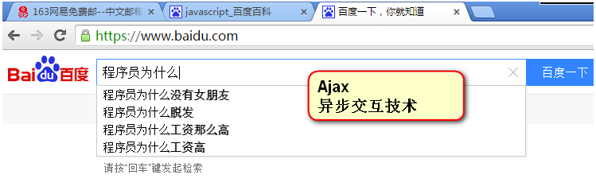

## JavaScript和ECMAScript的关系

ECMAScript是一种由Ecma国际前身为欧洲计算机制造商协会,英文名称是European Computer Manufacturers Association，制定的标准。

JavaScript是由公司开发而成的，公司开发而成的一定是有一些问题，不便于其他的公司拓展和使用。所以欧洲的这个ECMA的组织，牵头制定JavaScript的标准，取名为ECMAScript。

简单来说ECMAScript不是一门语言，而是一个标准。符合这个标准的比较常见的有：JavaScript、Action Script（Flash中用的语言）。就是说，你JavaScript学完了，Flash中的程序也会写了。

ECMAScript在2015年6月，发布了ECMAScript 6版本，语言的能力更强。但是，浏览器的厂商不能那么快的去追上这个标准。

## 今天的JavaScript：承担更多责任

2003年之前，JavaScript被认为“牛皮鲜”，用来制作页面上的广告，弹窗、漂浮的广告。什么东西让人烦，什么东西就是JavaScript开发的。所以浏览器就推出了屏蔽广告功能。

2004年JavaScript命运开始改变了，那一年谷歌公司，开始带头使用Ajax技术了，Ajax技术就是JavaScript的一个应用。并且，那时候人们逐渐开始提升用户体验了。

2010年的时候，人们更加了解HTML5技术了，HTML5推出了一个东西叫做Canvas（画布），工程师可以在Canvas上进行游戏制作，利用的就是JavaScript。

2011年，Node.js诞生，使JavaScript能够开发服务器程序了。

今天，JavaScript工程师是绝对的吃香，能够和iOS、Android工程师比肩，毫不逊色的。

现在，公司都流行WebApp，就是用网页技术开发手机应用。什么意思呢？手机系统有iOS、安卓、windows phone。那么公司比如说开发一个“携程网”APP，就需要招聘三队人马，比如iOS工程师10人，安卓工程师10人，windows工程师10人。共30人，工资开销大。并且，如果要改版，要改3个版本。所以，现在公司，都用web技术，用html+css+javascript技术来开发app。好处是不用招聘那么多工程师，只需要几个前端开发工程师即可。并且也易于迭代，就是网页一改变，所有的终端都变了。