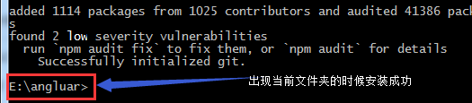
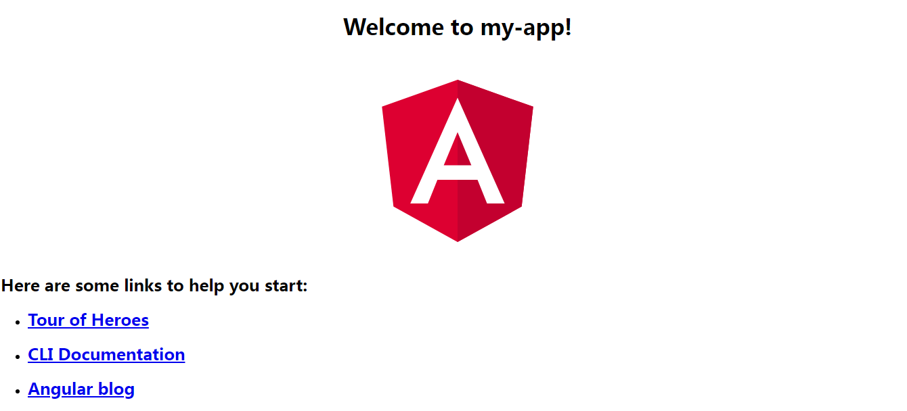
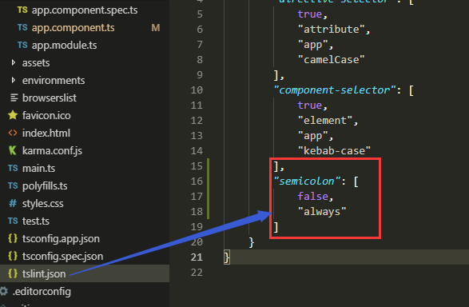
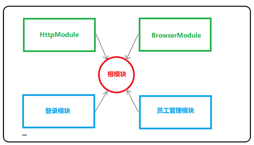
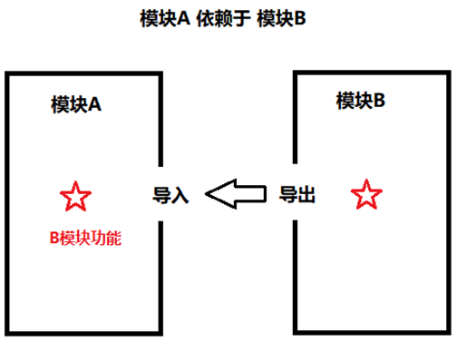
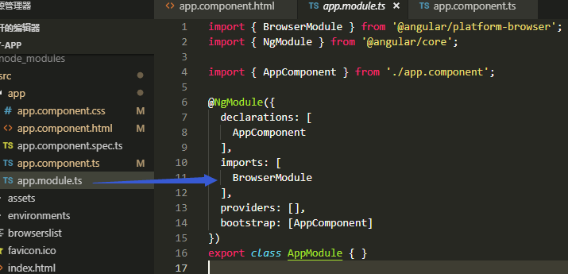
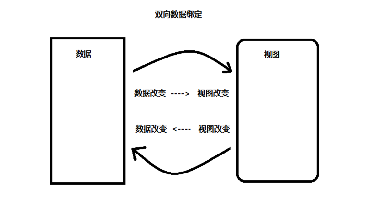

## angular网站

中文网：https://www.angular.cn

注：此文档主要是自己学习和参考angular网站编写的

## angular Cli项目

### 安装 Angular CLI

```javascript
npm install -g @angular/cli
```

查看是否安装成功

```javascript
ng -v
```

当出现'ng' 不是内部或外部命令，也不是可运行的程序或批处理文件的时候，

如果报错，就先删掉 C:\Users\adminstrator\AppData\Roaming\npm\node_modules\@angular\cli\node_modules 目录，然后再运行 npm install -g @angular/cli  查看是否安装成功

### 创建工作空间和初始应用

新建一个文件夹运行，运行下面的代码即代表创建一个项目

```
ng new my-app
```

my-app 是项目名称，可以修改为自己喜欢的名称

ng new 会提示你要把哪些特性包含在初始的应用项目中。请按回车键接受默认值。

注：第一次安装的时候速度较慢，可以多等待一段时间出现下面的图片的时候代表安装成功



进去当前文件夹目录

```
cd my-app
```

运行项目

```
ng serve --open
```

此时自动编译代码，完成之后会自动在浏览器打开页面，出现下面的图片代表项目创建成功



项目结构目录

```html
.
├── e2e                 端到端测试目录
├── src                 源文件（开发目录）
├── .editorconfig       编辑器统一风格工具配置文件
├── .gitignore          git忽略文件
├── angular.json        Angular CLI 脚手架配置
├── README.md           说明文件
├── package.json        npm配置文件
├── tsconfig.json       TypeScript编译器配置
└── tslint.json         TypeScript语法检查器配置

.
├── src
│   ├── app                 项目源文件( 重点 )
│   ├── assets              存放图片等资源文件
│   ├── browserslist        浏览器支持列表
│   ├── environments        运行环境配置：开发 or 生产
│   ├── favicon.ico         出现在浏览器标签上的应用图标。
│   ├── index.html          项目首页
│   ├── karma.conf.js       karma 测试运行器的配置
│   ├── main.ts             项目入口
│   ├── polyfills.ts        导入JS，兼容老版本浏览器
│   ├── styles.css          全局样式
│   ├── test.ts             测试入口
│   ├── tsconfig.app.json   TypeScript编译器配置
│   ├── tsconfig.spec.json  单元测试文件
│   └── tslint.json         额外的 TypeScript 语法检查器配置

.
├── app
│   ├── app.component.css       app组件样式
│   ├── app.component.html      app组件模板
│   ├── app.component.spec.css  app组件单元测试
│   ├── app.component.ts        app组件JS（TS）代码
│   ├── app.module.ts           根模块
```

## tslint 的配置

目的：修改为自己的代码风格

1. 在 `/tslint.json` 中找到要修改的配置文件
2. 将其添加到 `src/tslint.json` 文件中（或者直接在 `/tslint.json` 中修改）



此处主要是为了项目中的分号报错，修改为false的时候不写分号的时候也可以正常显示不会报错

## angular基本知识

### 组件（Component）

组件的组成部分

- 1 [组件名称].component.html
- 2 [组件名称].component.css
- 3 [组件名称].component.ts
- 单元测试文件（可选）[组件名称].component.spec.ts

修改app.component.html中的内容

```html
<div style="text-align:center" class="conter">
    <h1>
        hello {{ title }}!   // title主要是传递绑定的数据
    </h1>
</div>
```

修改app.component.css中的内容

```css
.conter {
    background: pink;
    font-size: 30px;
}
```

修改app.component.js中的内容

```javascript
import { Component } from '@angular/core';

@Component({
  selector: 'app-root',
  templateUrl: './app.component.html',
  styleUrls: ['./app.component.css']
})
export class AppComponent {
  title = '我是Angular';  // title是HTML中绑定的数据在浏览器中显示
}
```

保存以上的代码在浏览器中可以看到下图


### 模块

#### 模块介绍



- 每个应用至少有一个 Angular 模块，称为根模块
- 它通常命名为 AppModule
- 根模块的作用：启动应用
- 模块是独立、封闭的
- 模块之间的引用通过 导入 和 导出 来完成

#### 模块依赖



#### 模块包含的内容

- 组件
- 服务
- 指令
- 注意：这些内容必须在模块中配置后才有效

### 根模块

根模块的内容



#### @NgModule 装饰器

- 装饰器是一个函数
- 作用：修饰紧随其后的类或属性
- 装饰器是 JavaScript 的一种语言特性，处于语法提案的stage 2阶段，是一个试验特性
- 装饰器又叫做注解

- @NgModule是Angular提供的装饰器，用来告诉Angular将这个类当作 **模块** 来处理
- 语法：@NgModule({ 元数据对象 })

#### @NgModule装饰器的元数据对象

- declarations    该模块所拥有的组件
- imports            该模块依赖的模块，比如：BrowserModule
- providers         该模块所拥有的服务提供商
- bootstrap        指定根组件，只有根模块需要该配置项Angular 创建它并插入 index.html 宿主页面。
- exports            公开该模块其中的一部分，以便外部模块使用它们

#### @Component装饰器

- selector          选择器（组件名称），对应HTML中的组件名称
- template        组件的内联模板
- templateUrl   组件模板文件的 URL
- styleUrls         组件样式文件数组

数据绑定

数据绑定

## 数据绑定

### 数据绑定

1. 插值表达式   {{}}
2. 属性绑定  [href]=””
3. 事件绑定  (click)=””
4. 双向数据绑定  [(ngModel)]=””

### 双向数据绑定



## 实战项目


